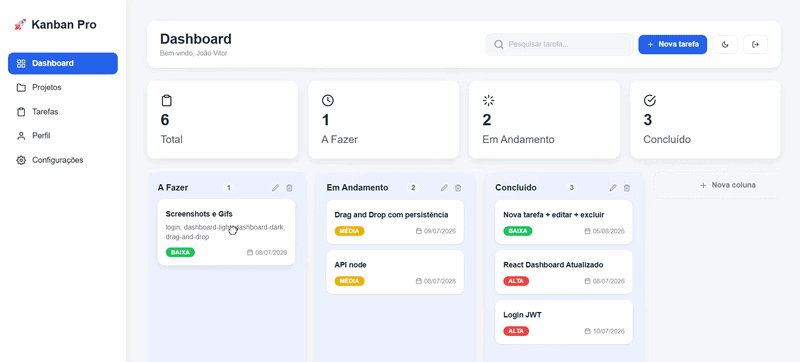
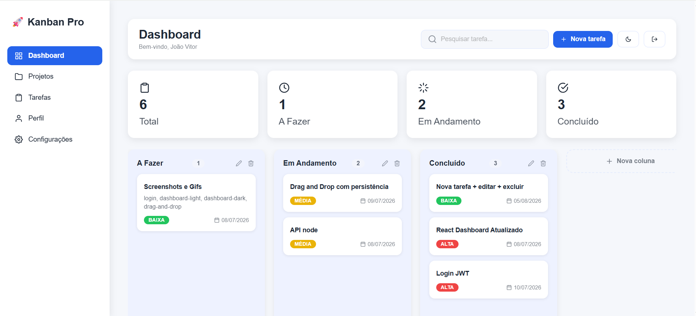
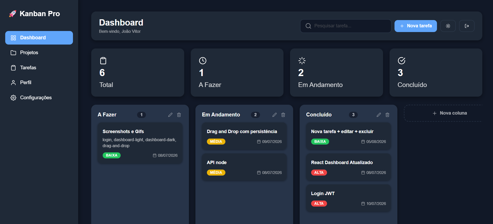
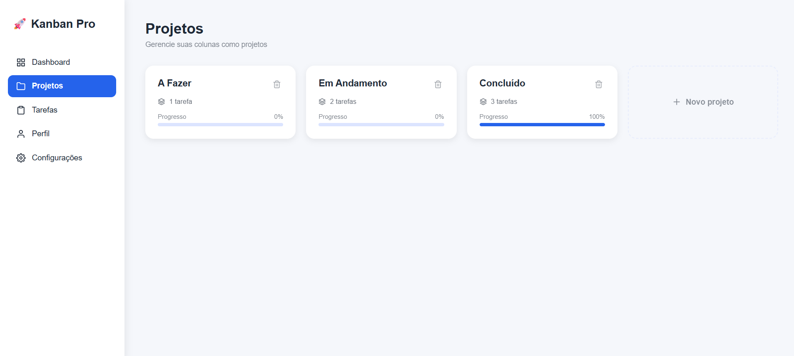
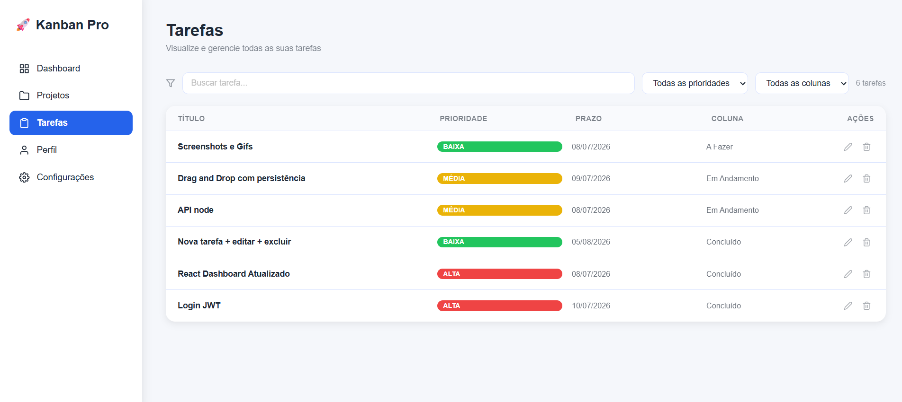
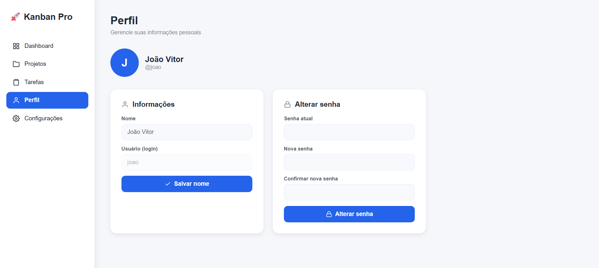
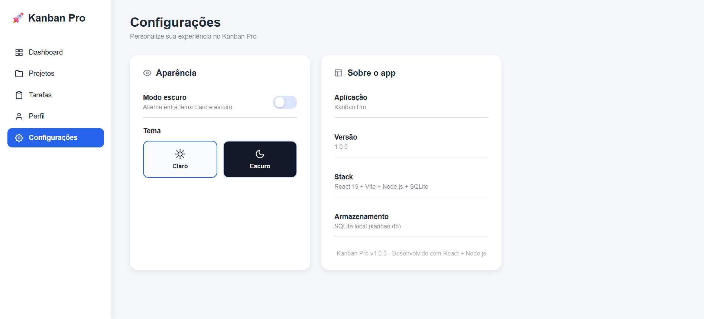
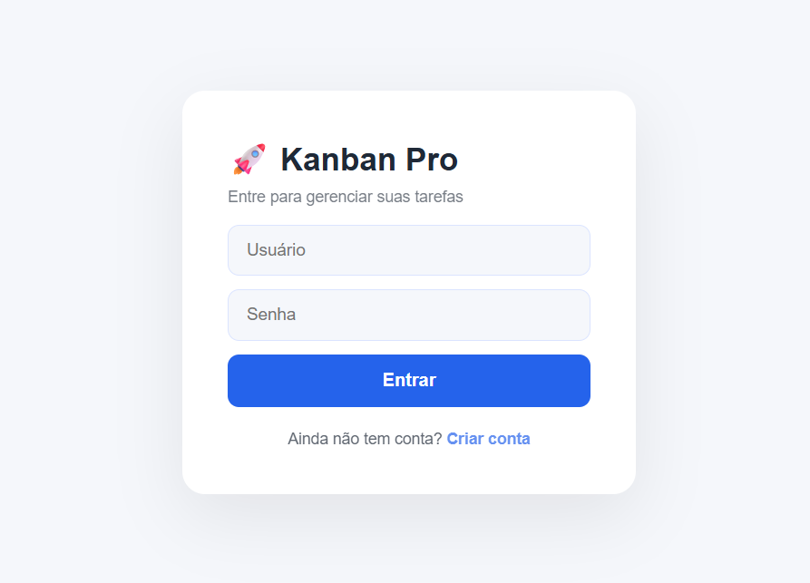
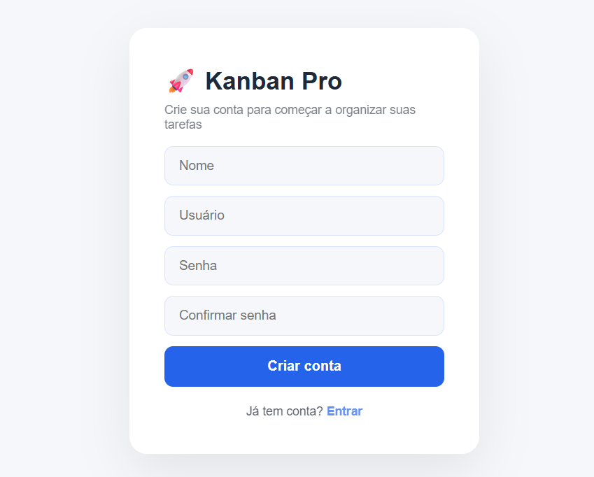
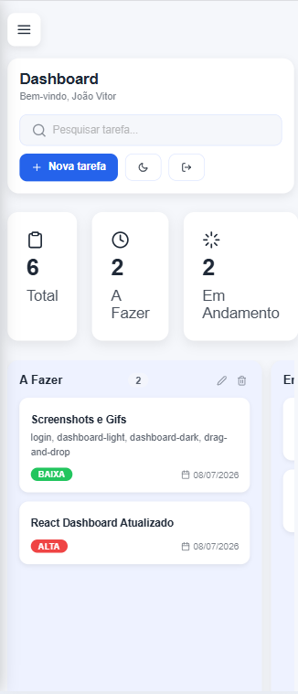

# 🚀 Kanban Pro

[](https://github.com/JoaoTech-hub/kanban-pro/actions/workflows/ci.yml)
[](./LICENSE)

Aplicação full stack de gerenciamento de tarefas no estilo Kanban, com autenticação, colunas e cards personalizáveis, drag-and-drop e tema claro/escuro. Projeto pessoal desenvolvido para portfólio.

 

## ✨ Funcionalidades

- Autenticação com registro, login e JWT
- Colunas (projetos) e cards (tarefas) totalmente customizáveis, com drag-and-drop entre colunas
- Prioridade, prazo e descrição por tarefa
- Página de Tarefas com busca e filtros (prioridade / coluna)
- Página de Projetos com progresso visual por coluna
- Edição de perfil (nome e senha)
- Tema claro/escuro persistido
- Notificações visuais (toasts) para ações de criar/renomear/excluir projeto
- Estados vazios tratados (colunas e listas sem itens nunca parecem "quebradas")
- Layout responsivo, com menu lateral retrátil no mobile
- Code-splitting por rota, com carregamento sob demanda das páginas

## 📸 Screenshots

### 📊 Dashboard



---

### 🌙 Dashboard (Tema Escuro)



---

### 📁 Gerenciamento de Projetos



---

### ✅ Gerenciamento de Tarefas



---

### 👤 Perfil



---

### ⚙️ Configurações



---

### ➕ Nova Tarefa


---

### 🔐 Login



---

### 📝 Cadastro



---

### 📱 Versão Mobile



## 🛠️ Stack

**Frontend:** React 19, Vite, React Router, styled-components, @hello-pangea/dnd, Axios
**Backend:** Node.js, Express 5, better-sqlite3, JWT, bcrypt, Zod (validação), Helmet, express-rate-limit
**Testes:** Vitest + Testing Library (frontend), Jest + Supertest (backend)
**CI:** GitHub Actions (lint, testes e build a cada push/PR)

## 🏗️ Arquitetura

```text
┌──────────────┐        HTTPS/JSON        ┌──────────────────┐
│   Frontend   │ ───────────────────────▶ │      Backend      │
│  React (SPA) │ ◀─────────────────────── │  Express (REST)   │
└──────────────┘        JWT Bearer        └──────────────────┘
          │
          ▼
┌──────────────────┐
│ SQLite (arquivo) │
└──────────────────┘
```

O backend segue arquitetura em camadas, para manter regra de negócio, validação e acesso a dados desacoplados:

routes → validators (Zod) → controllers → config/db (SQLite)
│
middlewares (auth, error handler)

- **routes/** define os endpoints e aplica os middlewares (autenticação, rate limit).
- **validators/** valida e normaliza o corpo da requisição com Zod antes de chegar ao controller.
- **controllers/** contém a regra de negócio de cada recurso (colunas, cards, perfil, auth).
- **middlewares/** cuida de autenticação (JWT) e centraliza o tratamento de erros.
- **config/db.js** concentra a conexão SQLite e a criação do schema (`CREATE TABLE IF NOT EXISTS`).

No frontend, a lógica de comunicação com a API fica isolada em hooks customizados (`useKanban`, `useColunas`), mantendo os componentes de UI focados em apresentação. Estado global de autenticação e tema fica em Context API (`AuthContext`, `ThemeContext`, `ToastContext`).

## 🧠 Decisões técnicas

- **SQLite (better-sqlite3) em vez de um banco cliente-servidor**: para um projeto de portfólio single-node, elimina a necessidade de infraestrutura extra (não precisa de um serviço de banco rodando à parte) sem abrir mão de SQL real e constraints (`FOREIGN KEY`, índices).
- **JWT sem refresh token (por enquanto)**: simplifica o fluxo de autenticação; listado no roadmap como próxima evolução, já que refresh token exige um mecanismo de revogação/rotação que vale a pena implementar com cuidado.
- **Validação com Zod no backend**: garante que dados inválidos nunca cheguem aos controllers, independentemente do que o frontend envie — o backend nunca confia apenas na validação do cliente.
- **Verificação de posse (`usuario_id`) em toda query**: cada operação em coluna ou card confirma que o recurso pertence ao usuário autenticado antes de ler, alterar ou apagar — evita que um usuário manipule dados de outro apenas adivinhando IDs (IDOR).
- **React.lazy por rota**: como o dashboard (com drag-and-drop) é a tela mais pesada, mas nem toda sessão a acessa imediatamente, dividir o bundle por rota reduz o JS carregado no primeiro acesso (tela de login).

## 📁 Estrutura do projeto

Kanban-Pro/
├── backend/
│   ├── src/
│   │   ├── config/        # conexão com o banco (SQLite)
│   │   ├── controllers/   # regras de negócio de cada recurso
│   │   ├── middlewares/   # autenticação e tratamento de erros
│   │   ├── routes/        # definição dos endpoints
│   │   ├── validators/    # schemas de validação (Zod)
│   │   └── app.js         # montagem do Express
│   ├── tests/              # testes de integração (Jest + Supertest)
│   └── server.js           # ponto de entrada
└── frontend/
└── src/
├── components/     # componentes reutilizáveis (inclui PageLoader)
├── context/        # AuthContext, ThemeContext, ToastContext
├── hooks/          # useKanban, useColunas
├── pages/          # telas da aplicação (carregadas via React.lazy)
├── services/       # cliente Axios
├── styles/         # styled-components e tema
└── tests/           # testes (Vitest + Testing Library)

## ▶️ Como rodar localmente

Pré-requisitos: Node.js 20+.

### 1. Clonar o repositório

```bash
git clone https://github.com/JoaoTech-hub/kanban-pro.git
cd kanban-pro
```

### 2. Backend

```bash
cd backend
npm install
cp .env.example .env
```

Abra o `.env` e gere um valor real para `JWT_SECRET`:

```bash
node -e "console.log(require('crypto').randomBytes(64).toString('hex'))"
```

Copie o resultado para dentro do `.env`. Depois, suba o servidor:

```bash
npm run dev
```

A API sobe em `http://localhost:3001`. O banco SQLite (`kanban.db`) é criado automaticamente no primeiro start, já com o schema completo.

### 3. Frontend

Em outro terminal:

```bash
cd frontend
npm install
cp .env.example .env
npm run dev
```

O app sobe em `http://localhost:5173`. Crie uma conta pela tela de registro e comece a usar.

## ✅ Rodando os testes

```bash
# backend
cd backend && npm test

# frontend
cd frontend && npm test
```

## 🔐 Variáveis de ambiente

**backend/.env**
| Variável | Descrição |
|---|---|
| `JWT_SECRET` | Segredo usado para assinar os tokens JWT. Gere um valor aleatório, nunca use um texto fixo. |
| `PORT` | Porta em que a API roda (padrão: `3001`). |
| `FRONTEND_URL` | Origem permitida pelo CORS em produção (ex: URL do deploy do frontend). |

**frontend/.env**
| Variável | Descrição |
|---|---|
| `VITE_API_URL` | URL base da API (ex: `http://localhost:3001` em desenvolvimento). |

## 🗺️ Roadmap

- [ ] Deploy público (Vercel + Render)
- [ ] Refresh token
- [ ] Campo `concluido` por card (hoje o progresso é estimado pelo nome da coluna)
- [ ] Documentação da API (OpenAPI/Swagger)

## 📄 Licença

Este projeto está sob a licença MIT — veja o arquivo [LICENSE](./LICENSE) para mais detalhes.

---

Desenvolvido por **João Vitor** — [GitHub](https://github.com/JoaoTech-hub)